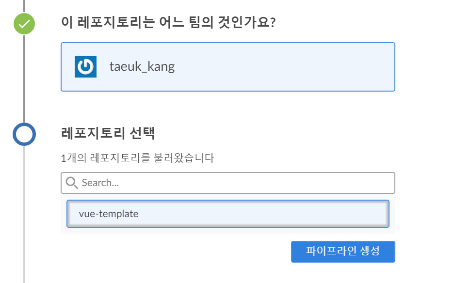

## Vue.js 환경 구축 기록일지

### 목표

- [x] Vue.js 템플릿 사용
  - [ ] 기본 문법 정리
  - [ ] vue-cli 내용 정리
  - [ ] Vuex 라우팅 구축
  - [ ] nuxt.js 서버 사이드 렌더링 짜기
  - [ ] SCSS 환경 구축
- [ ] Kubernetes 위에서 작동하기
- [ ] Github + Jenkins 연동
  - [ ] Jenkins pipeline 내용 정리
- [ ] Progressive Web App 으로 작성
- [ ] Mocha + StoryBook + Cypress 테스트 모듈 사용
- [ ] ESLint Rule 짜기
- [ ] 스타일 가이드 정리
  - [ ] Vue.js 스타일 가이드 정리
  - [ ] TOAST FE 가이드 정리
  - [ ] Clean code 가이드 라인 정리


## Vue 템플릿 사용

### 설치

```bash
npm i -g @vue/cli

npm update -g @vue/cli
```

### 프로젝트 생성

```bash
vue create vue-pwa-template
```

#### Result: 생성 내 모듈 리스트

```json
"dependencies": {
    "core-js": "^3.4.3",
    "register-service-worker": "^1.6.2",
    "vue": "^2.6.10",
    "vue-router": "^3.1.3",
    "vuex": "^3.1.2"
  },
"devDependencies": {
    "@vue/cli-plugin-babel": "^4.1.0",
    "@vue/cli-plugin-e2e-cypress": "^4.1.0",
    "@vue/cli-plugin-eslint": "^4.1.0",
    "@vue/cli-plugin-pwa": "^4.1.0",
    "@vue/cli-plugin-router": "^4.1.0",
    "@vue/cli-plugin-unit-mocha": "^4.1.0",
    "@vue/cli-plugin-vuex": "^4.1.0",
    "@vue/cli-service": "^4.1.0",
    "@vue/eslint-config-airbnb": "^4.0.0",
    "@vue/test-utils": "1.0.0-beta.29",
    "babel-eslint": "^10.0.3",
    "chai": "^4.1.2",
    "eslint": "^5.16.0",
    "eslint-plugin-vue": "^5.0.0",
    "node-sass": "^4.12.0",
    "sass-loader": "^8.0.0",
    "vue-template-compiler": "^2.6.10"
},
```


## Vue.js + Nginx Dockerfile 작성

### 설치

https://hub.docker.com/ 공식 홈페이지 참고

#### DockerFile 작성

```dockerfile
# Build
FROM node:lts-alpine as build-stage
WORKDIR /vue-pwa-project
COPY package*.json ./
RUN npm install
COPY . .
RUN npm run build

# Production
FROM nginx:stable-alpine as production-stage

RUN rm /etc/nginx/conf.d/default.conf
COPY ./docker/nginx.conf /etc/nginx/conf.d/nginx.conf

COPY --from=build-stage ./vue-pwa-project/dist /usr/share/nginx/html
EXPOSE 80
CMD ["nginx", "-g", "daemon off;"]
```

#### *별도 nginx.conf 

```nginx
server {
    listen 80;

    location / {
        alias /usr/share/nginx/html/;
        try_files $uri $uri/ /index.html;
    }
}
```

#### docker build

```bash
docker build -t kangtaeuk/vue-template .
```

```bash
docker run -it -p 8080:80 --rm kangtaeuk/vue-template
```


## Jenkins 환경 구축

### 도커로 표준 젠킨스 서버 생성

목표: [jenkins/jenkins 이미지](https://hub.docker.com/r/jenkins/jenkins)를 이용하여 컨테이너 생성 및 실행

#### 1. 젠킨스 도커 이미지 가져오기

```bash
docker pull jenkins/jenkins
# or
docker pull jenkins/jenkins:<tag>
```

#### 2. 도커 볼륨 생성

```bash
docker volume create jenkins_home_classic
```

이후, 볼륨이 생성됬는지 확인하기

```bash
docker volume ls

docker volume inspect jenkins_home_classic
```

#### 3. 도커 실행

```bash
docker run -d --name jenkins_classic \
-p 8081:8080 -p 50001:50000 \
-v jenkins_home_classic:/var/jenkins_home \
jenkins/jenkins
```

#### 4. 브라우저 접속

```
http://<docker IP>:8081
```

블루오션이 없는 최신 버전 표준 젠킨스가 실행이 된다.

>  * 번외: VSCODE에서 Docker 플러그인을 사용하면 더 편하게 진행이 가능하다.


### 기존 젠킨스에 블루오션 설정하기

#### 1. `Jenkins 관리 > 플러그인 관리 > 설치 가능`에서 블루오션 설치


`재시작 없이 설치하기` 클릭

#### Tip. 젠킨스 재시작법

`http://<젠킨스 URL:PORT>/restart`를 들어가면 재시작된다.

#### Result


### 젠킨스 Ngnix 구성하기

#### 배경

 젠킨스는 Ngnix 또는 Apache 같은 리버스 프록시 서버에서 운영하는 것이 일반적이다.

1. 젠킨스 스레드를 차단하지 않고도 느린 클라이언트에 정적 파일을 전송 가능
2. 젠킨스의 부하를 낮추기위해 정적 파일 캐싱, 서빙 수행 가능
3. Ngnix는 SSL 자원에 매우 효율적, 기본 제공되는 윈스턴 서블릿 컨테이너보다 더 좋음

#### 실행법

##### 1. proxy_pass를 젠킨스의 IP와 포트로 직접 연결

```ngnix
# ngnix *.conf 파일

upstream jenkins {
	keepalive 32;
	server 127.0.0.1:8080;
}

server {
	listen 80;
	server_name jenkins.example.com;
	
	root /var/run/jenkins/war/;
	
	access_log /var/log/nginx/jenkins/access.log;
	error_log /var/log/nginx/jenkins/error.log;
	ignore_invalid_headers off;	
}

location /userContent {
	root /var/lib/jenkins/;
	
	if (!-f $request_filename) {
		rewrite (.*) /$1 last;
		break;
	}
	
	sendfile on;
}

location @jenkins {
	sendfile off;
	proxy_pass http://jenkins;
	
	if ($request_uri ~* "/blue(/.*)") {
		proxy_pass http://jenkins/blue$1;
		break;
	}
	
	proxy_redirect default;
	proxy_http_version 1.1;
	
	proxy_set_header Host $host;
	proxy_set_header X-Real_IP $remote_addr;
	proxy_set_header X-Forwarded-For $proxy_add_x_forwarded_for;
	proxy_set_header X-Forwarded-Proto $scheme;
	proxy_max_temp_file_size 0;
	
	client_max_body_size 10m;
	client_body_buffer_size 128k;
	
	proxy_connect_timeout 90;
	proxy_send_timeout 90;
	proxy_read_timeout 90;
	proxy_buffering off;
	proxy_request_buffering off;
	proxy_set_header Connection "";
}

location / {
	if ($http_user_agent ~* '(iPhone|iPad)') {
		rewrite ^/$ /view/iphone/ redirect;
	}
	
	try_files $uri @jenkins;
}
```


### Nginx에서 젠킨스 블루오션 운영하기

#### 1. jenkins 컨테이너 실행

```bash
docker run -d --name jenkins -v jenkins_home:/var/jenkins_home jenkinsci/blueocean
```

젠킨스를 호스트 IP에 노출시키지 않음

#### 2. Ngnix 도커 이미지 다운

```bash
docker pull nginx
```

#### 3. Ngnix 도커 이미지 생성

```bash
docker run -d --name nginx -p 80:80 --link jenkins nginx
```

`--link` 옵션을 통해 nginx 컨테이너를 젠킨스 컨테이너에 연결

#### 4. docker exec 명령어 실행

```bash
docker exec -it nginx /bin/bash
```

#### 5. 우분투 패키지 업데이트

```bash
apt-get update
```

#### 6. `/etc/ngnix/conf.d` 백업 후 수정

```bash
cp etc/nginx/conf.d/default.conf etc/nginx/conf.d/default.conf.backup
```

```nginx
upstream jenkins {
    server jenkins:8080;
}

server {
    listen 80;
    server_name jenkins.example.com;
}

location / {
    proxy_pass http://jenkins;
    proxy_set_header Host $host;
    proxy_set_header X-Real-IP $remote_addr;
    proxy_set_header X-Forwarded-For $proxy_add_x_forwarded_for;
    proxy_set_header X-Forwarded-Proto $scheme;
}
```

#### 7. 컨테이너 재실행

```bash
exit
docker restart nginx
```

#### 8. 젠킨스 접속

`http://<도커 호스트 IP>` 로 접속 (`http://<도커 호스트 IP>:8080`으로 접속되선 안된다.)

>  기존 젠킨스 화면이 당신을 반겨준다면 성공!


### Jenkins Credentials 생성

#### 1. Jenkins Docker Image에 접속해서 ssh키 등록

```bash
# ssh 폴더 생성
mkdir -p /var/lib/jenkins/.ssh

# 이동
cd /var/lib/jenkins/.ssh

# ssh key 생성
ssh-keygen -t rsa -f /var/lib/jenkins/.ssh/ssh_key

# ssh_key.pub 복사
cat ssh_key.pub
```

#### 2. 복사한 ssh key를 젠킨스에 등록

`Jenkins 관리 > Credentials > global > Add Credentials` 버튼 클릭


------

### ~~Jenkins에 Docker 플러그인 설치~~

~~`Jenkins 관리 > 플러그인 관리 > 설치 가능 ` 에서 Docker를 검색하여 설치 ~~


#### ~~Docker 플러그인 설정~~

~~~~

##### ~~1. Cloud Tab에서 `Docker` 를 추가~~

~~~~


##### ~~2. Docker Host URI 알아내기~~


##### ~~3. Docker Cloud Details 버튼을 클릭 후 설정~~


> 이부분 이해가 안됨

-------


### Jenkins +  Bitbucket 연결

#### 1. 블루오션 접속 후, `파이프라인 생성` 버튼 클릭

#### 2. 소스관리를 BitBucket으로 설정 후 연결


