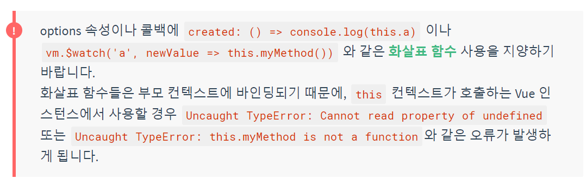
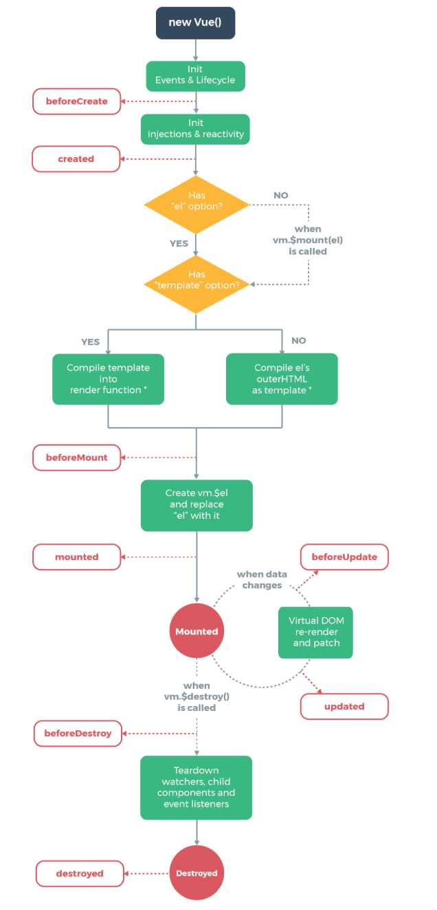

# 필수요소

Link : https://kr.vuejs.org/v2/guide/installation.html 링크 학습

목표 학습기간 : 2019-12-25 (하루)

## 설치방법

### npm

```bash
# 최신 안정화 버전
npm i vue
```

### cli

Link: https://cli.vuejs.org/

### 번들러

번들러는 Vue.js + Webpack 템플릿 보면 알 수 있을 듯

## 시작하기

### 선언적 렌더링

#### `{{}}`

```html
<div id="app">
    {{ message }} 
</div>
```

```js
var app = new Vue({
    el: `#app`,
    data: {
        message: `Hello, World`
    }
})
```

#### `v-bind` = 단방향 바인딩 (v-dom -> dom)

```html
<div id="app-2">
    <span v-bind:title="message">
    	텍스트
    </span>
</div>
```

```js
var app2 = new Vue({
    el: `#app-2`,
    data: {
        message: `데이터: ${new Date()}`
    }
})
```


### 조건문 / 반복문

#### 조건문 `v-if`

```html
<div id="app-3">
    <p v-if="seen">
        seen의 bool값에 따라 보일지 결정됨
    </p>
</div>
```

```js
var app = new Vue({
    el: `#app-3`,
    data: {
        seen: true
    }
})
```

#### 반복문 `v-for`

```html
<div id="app-4">
    <ol>
        <li v-for="todo in tods">
        	{{ todo.text }}
        </li>
    </ol>  
</div>
```

```js
var app4 = new Vue({
    el: `#app-4`,
    data: {
        todos: [
            {text: `Text1`},
            {text: `Text2`},
            {text: `Text3`}
        ]
    }
})

// 리스트 추가법
// app4.todos.push({text: `Text4`})
```

### 사용자 입력 핸들링 `v-on:event`, `v-model`

#### `v-on`

```html
<div id="app-5">
    <p>{{message}}</p>
    <button v-on:click="onclickBtn">
        버튼
    </button>
</div>
```

```js
var app5 = new Vue({
    el: `#app-5`,
    data: {
        message: `First Message.`
    },
    methods: {
        onclickBtn: function () {
            this.message = `Message Change!`
        }
    }
})
```

#### `v-model` = 양방향 바인딩

```html
<div id="app-6">
    <p>{{ message }}</p>
    <input v-model="message">
</div>
```

```js
var app6 = new Vue({
    el: `#app-6`,
    data: {
        message: `Hello`
    }
})
```

### 컴포넌트 이용법

```js
Vue.component(`todo-item`, {
    props: [`todo`]
    template: `<li>{{ todo.text }}</li>`
})

var app = new Vue(...)
```

```html
<div id="app-7">
    <ol>
        <todo-item
                   v-for="item in list"
                   v-bind:todo="item"
                   v-bind:key="item.id"
        ></todo-item>
    </ol>
</div>
```

```js
Vue.component(`todo-item`, {
    props: [`todo`],
    template: `<li>{{ todo.text }}</li>`
})

var app7 = new Vue({
    el: `#app-7`,
    data: {
        list: [
            {id: 0, text: `text1`},
            {id: 1, text: `text2`},
            {id: 2, text: `text3`}	
        ]
    }
})
```

## Vue 인스턴스

### vue 인스턴스 만들기

```js
var vm = new Vue({})
```

### 속성과 메소드

```js
var data = {a: 1}

var vm = new Vue({
    data: data
})

vm.a === data.a // true

vm.a = 2
data.a // => 2 (참조 복사임, swallow)

data.a = 3
vm.a // => 3 양방향임
```

#### `Object.freeze()`

```js
var obj = {
    foo: `bar`
}

// obj가 변경되도 반영되지 않음
Object.freeze(obj)

new Vue({
    el: `#app`,
    data: obj
})
```

```html
<div id="app">
    <p>{{ foo }}</p>
    <button v-on:click="foo = 'baz'">
        Change
    </button>
</div>
```

#### `$` 유용한 속성 및 메소드

```js
var data = {a: 1}
var vm = new Vue({
    el: `#example`,
    data: data
})

vm.$data === data // true
vm.$el === document.querySelector(`#example`) // true

vm.$watch(`a`, (newVal, oldVal) => {
    // vm.a 메소드가 변경되면 호출됨
})
```


### 인스턴스 라이프사이클 훅

```js
new Vue({
    data: {
        a: 1
    },
    created: function() {
        // this는 vm 인스턴스를 가르킴
        console.log(`a = ${this.a}`)
    },
    
})
```

#### beforeCreate

가장 먼저 실행되는 훅

data, events(vm.$on, $once, $off, $emit) 세팅되지 않음

#### created

data와 events가 활성화된 시점 ~ 템플릿과 가상돔은 마운트·렌더링 되지 않음

#### beforeMount

렌더링 일어나기 직전

#### mounted

컴포넌트, 템플릿, 돔에 접근가능한 시점, 모든 하위 컴포넌트 마운트를 보장하지는 않음
자식부터 차근차근 생성 후 부모가 생성되기 때문에 주의 (무조건, 순서대로 되지 않을 수도 있음)

#### beforeUpdate

dom이 새로 업데이트되기 직전 시점

#### updated

재 렌더링 이후, 실행된다. 잘못 작성한다면 무한루프에 빠질 수 있음

#### beforeDestroy

뷰 인스턴스 제거되기 직전 시점, 컴포넌트의 원래 형태를 그대로 유지된 상태
이벤트 리스너를 제거하기 좋은 시점

#### destroyed

인스턴스 제거 후 시점, vue의 모든 디렉티브 바인딩과 리스너가 제거






## 템플릿 문법

### interpolation

#### `v-once`

```html
<span v-once>한번 이후, 변경되지 않음 {{ msg }}</span>
```

#### `v-html`

```html
# rawHtml = `<span style="color:red">HTML</span>`
<span v-html="rawHtml"></span>
```

데이터 바인딩이 무시됨, Vue는 문자열 기반 템플릿 엔진은 아니여서, `v-html`을 이용한 템플릿을 사용할 수는 없음
또한 XSS 취약점이 존재하기 때문에, 사용자 폼에서는 금지

#### `v-bind:`

```html
<div v-bind:id="dynamicId"></div>
```

```html
<button v-bind:disabled="isButtonDisabled">Button</button>
```

`isButtonDisabled`가 `null`, `undefined`, `false`면 속성으로 표시되지 않음

#### Javascript 표현식

```js
// 여러 표현식 사용 가능, 대신 구문은 작성 불가능(ex. 선언/if문은 작동하지 않음)
{{ number + 1 }}

{{ ok ? 'YES' : 'NO' }}

{{ message.split(``).reserve().join(``) }}
```

```html
<div v-bind:id="'last-' + id"></div>
```

### 디렉티브

#### 동적 전달인자 (2.6.0+부터 생김)

```html
<a v-bind:[attribueName]="url">...</a>

<a v-on:[attribueName]="function">...</a>
```

대신 스페이스나 따옴표를 쓰지말 것, 또한 소문자만 쓰는 것이 좋음

```html
<!-- 컴파일러 경고를 불러옵니다 -->
<a v-bind:['foo' + bar]="value"> ... </a>
```

#### `preventDefault()`

```html
<form v-on:submit.prevent="onSubmit"></form>
```

### 약어

#### v-bind 약어

```html
<!-- 전체 -->
<a v-bind:href="url">...</a>

<!-- 약어 -->
<a :href="url">...</a>

<!-- 동적 -->
<a :[key]="url">...</a>
```

#### v-on 약어

```html
<!-- 전체 -->
<a v-on:click="function">...</a>

<!-- 약어 -->
<a @click="function">...</a>

<!-- 동적 -->
<a @[event]="function">...</a>
```

## computed와 watch

### computed 배경

너무 많은 템플릿 내 표현식은 유지보수가 힘듬

```html
<!-- 어려움 -->
<div id="example">
  {{ message.split('').reverse().join('') }}
</div>
```

### computed 예제

```html
<div id="example">
    <p>원본: {{ message }}</p>
    <p>역순: {{ reversedMessage }}</p> 
</div>
```

```js
var vm = new Vue({
    el: `#example`,
    data: {
        message: `안녕`
    },
    computed: {
        reversedMessage: function() {
            return this.message.split(``).reverse().join(``)
        }
    }
})
```

### computed vs method

차이점: `computed`는 종속 대상이 변경될 때만 함수를 실행하고, 변경되지 않으면 그 이전 계산했던 값을 돌려줌
`Date.now()`처럼 아무곳에 의존되지 않은 값은 업데이트 되지 않음

이것과 비교하여 `method`는 항상 함수를 재실행함

### computed vs watch

```html
<div id="demo">{{ fullName }}</div>
```

비교(**watch**)

```js
var vm = new Vue({
    el: `#demo`,
    data: {
        firstName: `TAEUK`,
        lastName: `KANG`,
        fullName: `TAEUK KANG`
    },
    watch: {
        firstName: function(val) {
            this.fullName = val + ` ` + this.lastName
        },
        lastName: function(val) {
            this.fullName = this.firstName + ` ` + val
        }
    }
})
```

**computed**

```js
var vm = new Vue({
    el: `#demo`,
    data: {
        firstName: `TAEUK`,
        lastName: `KANG`
    },
    computed: {
        fullName: function() {
            return `${this.firstName} ${this.lastName}`
        }
    }
})
```

### computed(setter)

computed는 기본적으로 getter함수이지만, setter로 지정하여 만들 수 있음

```js
computed: {
    fullName: {
        // getter
        get: function() {
            return `${this.firstName} ${this.lastName}`
        },
        // setter
        set: function(newValue) {
            var names = newValue.split(` `)
            this.firstName = names[0]
            this.lastName = names[names.length - 1]
        }
    }
}
```

vm.fullName = `TAEUK KANG` 실행하면, 업데이트가 되는 것을 볼 수 있음

### watch

비동기식 또는 시간이 많이 소요되는 조작을 수행하려는 경우에 가장 유용

```html
<div id="watch-example">
    <p>
        yes/no ?
        <input v-model="question">
    </p>
    <p>{{ answer }}</p>
</div>
```

```js
// axios, lodash 사용 예제
var watchExampleVM = new Vue({
    el: `#watch-example`,
    data: {
        question: ``,
        answer: `대답 미입력`
    },
    watch: {
        question: function(newQuestion) {
            this.answer = `입력 대기 중...`
            this.getAnswer()
        }
    },
    methods: {
        // _.debounce는 lodash가 제공하는 기능, 시간이 많이 소요되는 작업에 실행 빈도를 제한
        getAnswer: _.debounce(
        	function() {
                if (this.question.indexOf(`?`) === -1) {
                    this.answer = `질문에 물음표를 넣어줘`
                    return
                }
                this.answer = `생각 중...`
                var vm = this
                
                axios.get(`api url`).then(res => {
                    vm.answer = _.capitalize(res.data.answer)
                }).catch(err => {
                    vm.answer = `Err! ${err}`
                })
            },
            // 사용자가 기다리는 시간(ms)
            500
        )
    }
})
```

## 클래스와 스타일 바인딩

### 클래스 동적 토글

```html
<div v-bind:class="{ active isActive }"></div>
```

```html
<div
     class="static"
     v-bind:class="{ active: isActive, 'test-danger': hasError}">
</div>
```

```js
data: [
    isActive: true,
    hasError: false
]
```

**결과값:**

```html
<div class="static active"></div>
```

굳이 인라인 스크립트를 쓰지 않아도 됨

```html
<div v-bind:class="classObject"></div>
```

```js
data: {
    classObject: {
        active: true,
        'text-danger': false
    }
}
```

```js
// computed도 가능
data: {
  isActive: true,
  error: null
},
computed: {
  classObject: function () {
    return {
      active: this.is	Active && !this.error,
      'text-danger': this.error && this.error.type === 'fatal'
    }
  }
}
```

#### 배열

```html
<div v-bind:class="[activeClass, errorClass]"></div>
```

```js
data: {
    activeClass: `active`,
    errorClass: `text-danger`
}
```

##### Result: 

```html
<div class="active text-danger"></div>
```

##### 삼항연산자

```html
<div v-bind:class="[isActive ? activeClass : '', errorClass]"></div>
```

```html
<div v-bind:class="[{active: isActive}, errorClass]"
```

#### 컴포넌트

Vue 컴포넌트의 기존 클래스가 덮어쓰기 되지않고, 추가됨. 바인딩도 마찬가지

```js
Vue.component(`my-component`, {
    template: `<p class="foo bar">Hi</p>`
})
```

```html
<my-component class="baz boo"></my-component>
```

##### Result:

```html
<p class="foo bar baz boo"></p>
```

### 인라인 스타일 바인딩

#### `b-bind:style`

속성 이름에 camelCase와 kebab-case (따옴표를 함께 사용해야 합니다)를 사용

```html
<div v-bind:style="{ color: activeColor, fontSize: fontSize + 'px'}"></div>
```

```js
data: {
    activeColor: `red`,
    fontSize: 30
}
```

데이터 밑 객체를 삽입하여 간결하게

```html
<div v-bind:style="styleObject"></div>
```

```js
data: {
    styleObject: {
        color: `red`,
        fontSize: `13px`
    }
}
```

```html
<!-- 여러 스타일시트 사용 가능 -->
<div v-bind:style="[baseStyles, overridingStyles]"></div>
```

#### 자동 접두사

```html
<div v-bind:style="{ display: ['-webkit-box', '-ms-flexbox', 'flex'] }"></div>
```

그런데 그냥 PostCSS의 autoPrefixer을 쓰는게 편해보임.

## 조건부 렌더링

### `v-if`, `v-else`

```html
<h1 v-if="ok">Yes</h1>
<h1 v-else>No</h1>

<div v-if="type === 'A'">A</div>
<div v-else-if="type === 'B'">B</div>
<div v-else-if="type === 'C'">C</div>
<div v-else>Not A/B/C</div>
```

`v-else` 엘리먼트는 `v-if` 엘리먼트 또는 `v-else-if` 엘리먼트 바로 뒤에 있어야 합니다. 그렇지 않으면 인식할 수 없습니다.

#### `<template>`의 `v-if`

```html
<template v-if="ok">
  <h1>Title</h1>
</template>

<template v-if="loginType === 'username'">
  <label>사용자 이름</label>
  <input placeholder="사용자 이름을 입력하세요" key="username-input">
</template>
<template v-else>
  <label>이메일</label>
  <input placeholder="이메일 주소를 입력하세요" key="email-input">
</template>
```

### `v-show`

```html
<h1 v-show="ok">안녕하세요!</h1>
```

`v-if`와 다른 점은 항상 DOM에 남겨져 있고, css의 display 상태로만 감춰져있음
그러므로, 매우 자주 바뀌는 렌더링 비용은 `v-show`를 이용하는 것을 권장


### 주의사항 `v-for`우선순위

`v-for`가 `v-if`보다 높은 우선순위 권을 갖기 때문에 사용에 주의할 것

## 리스트 렌더링


## 이벤트 핸들링

## 폼 입력 바인딩

## 컴포넌트


# 컴포넌트 모아보기

## 컴포넌트 등록

## Props

## 커스텀 이벤트

## 슬롯(slots)

## 동적 & 비동기 컴포넌트

## Handling Edge Cases


# 트랜지션 & 애니메이션

## 진입/진출? 봐야알 듯

## 상태 트랜지션


# 재사용 & 컴포지션

## 믹스인

## 사용자 지정 디렉티브

## Render Functions & JSX

## 플러그인

## 필터


# 도구

## 싱글 파일 컴포넌트

## 단위 테스팅

## Typescript

## 배포


# 스케일링 업

## 라우팅

## 상태 관리

## 서버사이드 렌더링

## Security


# 내부

## 반응형